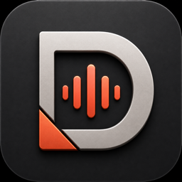

<p align="center">
  
</p>

<h1 align="center">Dictabar</h1>

<p align="center">
  Fast, private voice typing for macOS — in any app.
</p>

<p align="center">
  <a href="https://github.com/promantos/dictabar-updates/releases/latest"></a>
  
  
  <a href="LICENSE"></a>
</p>

Dictabar lives in the menu bar. Press a shortcut, speak, and the transcript is
inserted into the app you are already using. Run speech recognition entirely on
your Mac or bring an API key for the provider you prefer.

## Install

### Homebrew

```bash
brew install --cask promantos/tap/dictabar
```

### Direct download

1. Download the latest signed
   [`Dictabar-x.y.z.zip`](https://github.com/promantos/dictabar-updates/releases/latest).
2. Unzip it and move **Dictabar.app** to **Applications**.
3. Open Dictabar and complete the permission walkthrough.

Official builds are signed with Developer ID, notarized by Apple, and updated
in place with Sparkle. Dictabar does not require a DMG or installer package.

## Why Dictabar

- **Works everywhere** — dictate into browsers, editors, messengers, terminals,
  documents, and any other app that accepts text.
- **Local or cloud** — use on-device speech models or choose from 25 cloud and
  self-hosted providers.
- **Bring your own key** — Dictabar does not proxy your audio through a
  Dictabar server.
- **Multilingual** — automatic language detection and explicit language
  selection for supported providers.
- **Native macOS app** — global shortcuts, menu-bar controls, microphone
  selection, launch at login, and secure automatic updates.
- **Your workflow, your settings** — hold or toggle shortcuts, paste or type
  insertion, clipboard preservation, trailing space/newline, sounds, overlays,
  and optional local history.
- **Open source** — the application source is available under GPL-3.0-only.

## Quick start

1. Launch Dictabar from **Applications**.
2. Allow **Microphone** access.
3. Allow **Accessibility** access so Dictabar can insert text.
4. Choose either **Local Models** or a cloud provider and save its API key.
5. Press **Right Command** to start and stop dictation.

Right-side modifier shortcuts may also require **Input Monitoring**. Every
shortcut and activation mode can be changed in Settings.

## Speech engines

### On-device

Local models run on Apple silicon and keep recorded audio on this Mac:

| Model | Runtime |
|---|---|
| Parakeet TDT 0.6B v3 | Core ML |
| Nemotron 3.5 ASR | Core ML |
| Qwen3-ASR 0.6B | MLX |
| MOSS Transcribe Diarize 0.9B | MLX |

Models are downloaded only when requested. Their weights are not part of this
repository and remain under the model publisher's license; see
[third-party notices](THIRD_PARTY_NOTICES.md).

### Cloud and self-hosted

Supported providers include OpenAI, Groq, Deepgram, Mistral, Soniox, Gladia,
Speechmatics, ElevenLabs, AssemblyAI, OpenRouter, Azure Speech, Google Cloud,
Fireworks, Together, xAI, Amazon Transcribe, Cloudflare Workers AI, and a custom
OpenAI-compatible endpoint.

Cloud providers receive the completed recording directly from Dictabar. Their
pricing, retention, and data-processing terms apply.

## Privacy

Dictabar has no account system, analytics SDK, advertising, or Dictabar-hosted
speech service.

| Data | Where it goes |
|---|---|
| Audio with a local model | Stays on this Mac |
| Audio with a cloud provider | Goes directly to the selected provider |
| Provider API keys | Local `secrets.json`, mode `0600` |
| Transcript history | Local only, up to 30 items, can be disabled or cleared |
| Update checks | Public GitHub-hosted Sparkle feed |

Recordings are deleted after processing unless Debug mode is enabled. A failed
recording may be retained locally for up to 24 hours so it can be retried.
See the full [privacy policy](PRIVACY.md).

## Build from source

Requirements:

- macOS 15 or newer
- Apple silicon
- full Xcode

```bash
git clone https://github.com/promantos/dictabar.git
cd dictabar
open Dictabar.xcodeproj
```

Choose the **Dictabar** scheme and run the Debug configuration. Xcode resolves
the pinned Swift package versions automatically.

Command-line build:

```bash
xcodebuild \
  -project Dictabar.xcodeproj \
  -scheme Dictabar \
  -configuration Debug \
  -derivedDataPath build/DerivedData \
  -skipPackagePluginValidation \
  build
```

Useful checks:

```bash
bash Tests/check_permissions.sh
bash Tests/check_provider_catalog.sh
bash Tests/check_hardening.sh
```

Release signing and notarization are documented in
[PRODUCTION.md](PRODUCTION.md). The maintainer's Apple and Sparkle private keys
are intentionally not part of the source distribution.

## Contributing

Bug reports and focused pull requests are welcome. Please:

1. Open an issue before starting a large change.
2. Keep changes small and include one runnable check for non-trivial logic.
3. Run the relevant scripts in `Tests/` and `git diff --check`.

By submitting a contribution, you agree to license it under GPL-3.0-only.
Security issues must be reported privately as described in
[SECURITY.md](SECURITY.md).

## License

Copyright © 2026 Roman Platonov.

Dictabar is free software licensed under the
[GNU General Public License v3.0 only](LICENSE). Third-party packages and
downloadable model weights keep their own licenses; see
[THIRD_PARTY_NOTICES.md](THIRD_PARTY_NOTICES.md).
